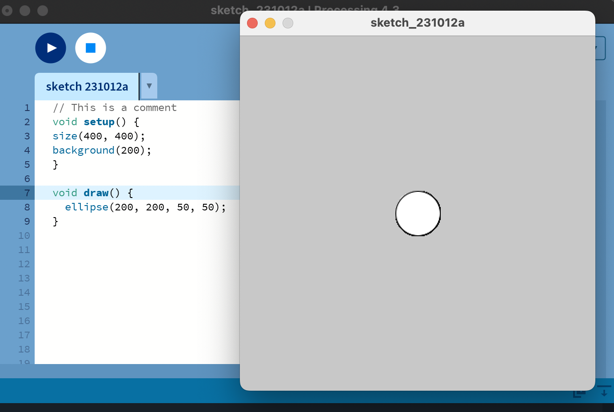

# Introduction to Processing with Java

---

## Objective

To familiarize one with the Processing environment and its basic functions, as well as to provide an introduction to Java programming concepts.

---

## Part 1: Setting up Processing

1. Installation

  Download and install the Processing software from <a href="https://processing.org/reference">Processing Reference</a>

  Open the Processing IDE and familiarize yourself with the interface.

 

## Part 2: First Sketch

2. First Sketch

Before looking at the answer, research and document how to create a new sketch, and record your answer. Next, verify your code below, and define  what each word is doing
 

Code Answer

 

Press the play button (or Ctrl+R) to run your sketch.

Detailed Answer

You should see a window with a circle in the center of it. This is because the <pre>
  <code>size(400, 400)</code></pre> function sets the size of the window to be 400x400 pixels, the <pre>
  <code>background(200)</code></pre> function sets the background color to a shade of gray, and the <pre>
  <code>ellipse(200, 200, 50, 50)  </code>
</pre>function draws a circle in the center of the window with a width and height of 50 pixels.

Void means the function will not return a value
the () is where an argument for the function would go
{} denotes everything that belongs to the function

  
 Void Setup 

Imagine you have a sketchbook. Before you start drawing, you might prepare your page, decide on the background color, or choose your tools. Once everything's set up, you start drawing, and maybe you keep drawing patterns over and over on the same page.
 

**1. `void setup()`: Preparing Your Sketchbook**
 

In Processing, the `void setup()` function is like preparing your sketchbook. It runs once, right at the beginning when you first start your program.

Inside `void setup()`, you can:
- Set the size of your canvas (using the `size()` function).
- Choose the background color (with the `background()` function).
- Initialize variables.
- Load images, fonts, or sounds you want to use later.
- Basically, any initial preparations you need before your main drawing begins.
 

Example:

<pre>
  <code>
  void setup() {
      size(400, 400);          // Set canvas size to 400 pixels by 400 pixels
      background(255, 0, 0);   // Set background color to red
    }
  </code> </pre>
  

  
 Void Draw 

   
  `void draw()`: Continuously Drawing on Your Canvas
   
  Now, the `void draw()` function is like the act of drawing on that prepared sketchbook page. But there's a twist! Whatever you put inside `void     draw()` happens over and over again, almost like you're drawing, erasing, and redrawing repeatedly super fast (typically 60 times per second).
   
  This makes it perfect for animations, games, or any interactive programs where things change over time.
   
  Inside `void draw()`, you can:
  - Draw shapes (like circles, rectangles, lines, etc.).
  - Check for user inputs (like mouse clicks or key presses).
  - Update positions of objects for animations.
  - Change colors, sizes, or any other properties of your drawings.

Example:
<pre>

  <code>

  void draw() {
    background(220);         // Set a gray background every frame
    ellipse(mouseX, mouseY, 50, 50);  // Draw a circle at the mouse position
  }
  </code>
</pre>
  Give the code example a try!
</deatails>

Here, the `ellipse()` function draws a circle. The `mouseX` and `mouseY` are special variables that always store the current position of the mouse. Since `draw()` is running over and over, the circle will appear to follow your mouse as you move it around the canvas!
 
**In summary:**
- `void setup()`: Run once at the beginning. Set the stage!
- `void draw()`: Run continuously after setup. It's where the action happens!

When you're just starting, remember that it's okay if things don't make perfect sense right away. With time and practice, it'll become second nature! And the most important thing is to have fun experimenting and creating with Processing.

 

## Part 3. Create an Emoji

Create an emoji expressing some type of information: feelings, seasons, thoughts, etc. This may be an existing emoji or your own new emoji! Take a look here for some ideas: <a href="https://emojipedia.org/" width="700" height="600">Emoji Reference</a>

Step One

1. Set the canvas size, background color, and shape color:
 

 

Step Two

2. Use geometry to create the face:
 

 

Step Three

3. Use Documentation to pick one new function to use in your assignment:
   <a href="https://processing.org/reference"> Processing Documentation </a>

## Project Checklist
12.5 points per checkbox
  
- [ ] Void Setup used </input>
- [ ] Void Draw used
- [ ] Researched Function Used
- [ ] Line Used
- [ ] 3 Unique Shapes Used
- [ ] Background Color Used
- [ ] Fill Used
- [ ] Unique Emoji

