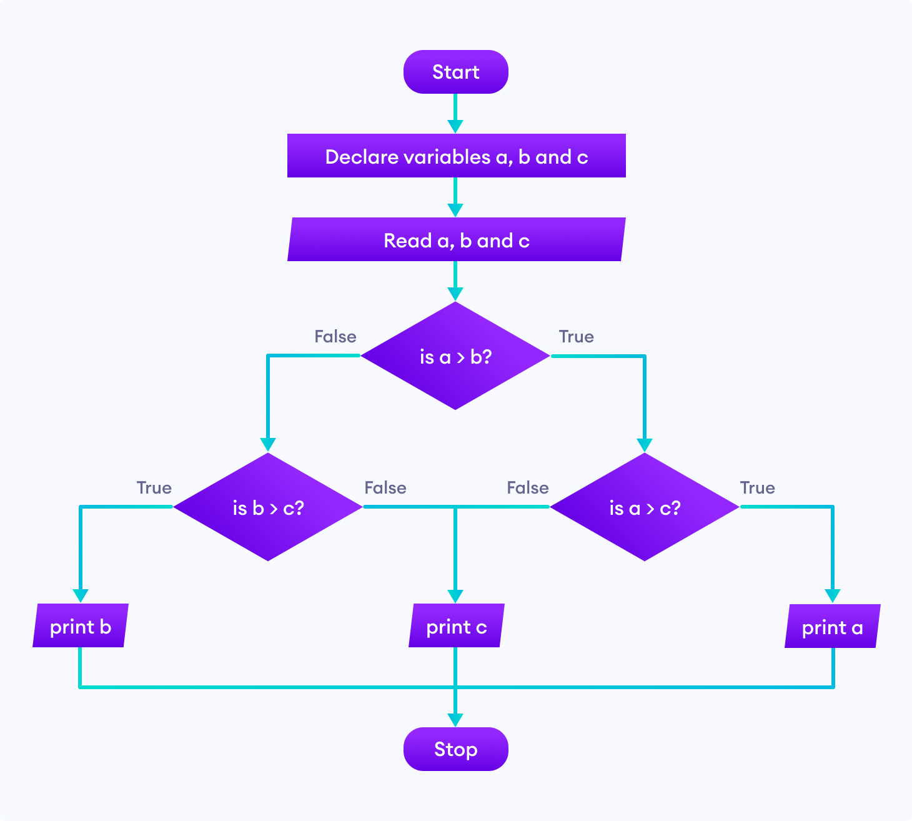
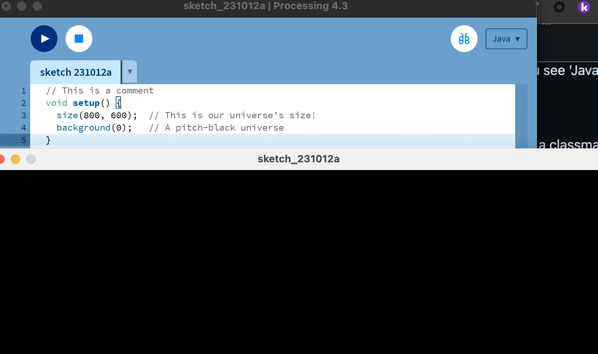
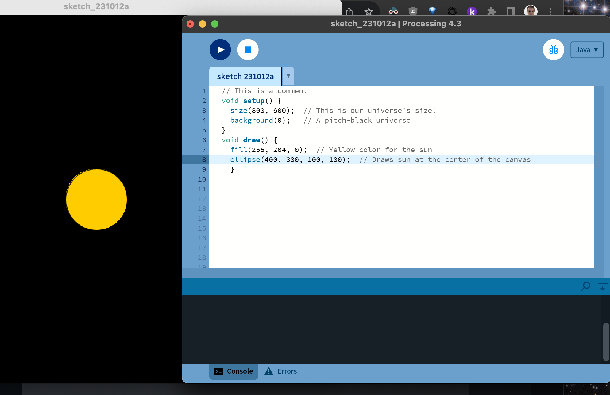
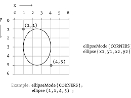
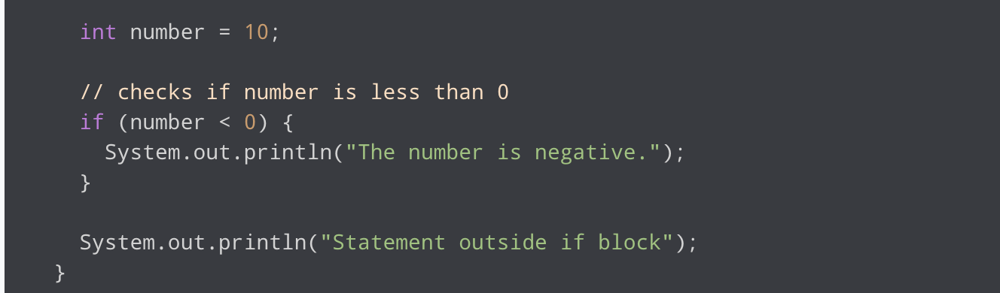

# 🌌 Solar System in Processing 🪐

Hello, budding astronomers and programmers! Let's embark on an interstellar journey to create a model of our solar system at a certain point in time. Don't worry, soon we'll make those celestial bodies revolve! 🚀 First, however, you should click on the gif below to decide which phase of our solar system you will simulate. 

Click to learn about the solar system

---
## 👻 Plan 👻

Answers these for planning

    
    1. What are you going to build?
    2. What colors will you use? 
    3. What shapes will you use? 
    4. What future actions will you want your planets/stars to do?
    5. How will you know you are done?
    6. How will you take risks while building?
    7. What is the final product?
    8. Who is doing what?
    9. When will this be done?
    10. What is your favorite time of the year?
    

---

## 🎃 Peer Review 🎃

What/How

    
    
Before moving on, you must have your idea/plan peer-reviewed by three other students
    
1. When Being reviewed:
- Create a flow chart of your program logic. 
- Explain how said logic will represent the science aspect of our solar system by doing x,y, and z,
- Explain how said logic will represent the artistic aspect of our solar system by doing x,y, and z credit.

    
 Flow Chart 

2. When Reviewing: Provide a grow, glow, and original comment 

---

## ⭐ Step 1: Set up the Cosmic Canvas

  
👾 Code Example

 🦮 Hint

    
"The `size(800, 600);` sets our universe's width and height. Feel free to make it bigger or smaller!"

##  🌟  Step 2: Light Up the Stars

  
👾 Code Example

    

  
 🦮 Hint

   
 The `ellipse(400, 300, 100, 100);` function draws the sun. The first two values set the position (x,y), and the last two values set the width and height of the ellipse.
 

You already have been making flow charts and using conditionals! here is a basic condition in Java!
 
 

## Step 3 & 4:  If 🐁 do
Look up and add user input and a conditional to your program. I suggest using the mouse, but you can use whichever method you like. 

  
🌟 Input Hint

    Input is the first thing I think about. What data does the program need? Check out this link to see how processing allows a programmer to create interactive works of art!
     
     
    <a href="https://processing.org/examples/mousefunctions.html" > Processing Mouse Example </a>

  
 🦮 If/Else Hint

   If statements in Java are the same as in every language. The only change is in the structure of the words, i.e., syntax.
  

    
 Flow Chart 

    
Here is the actual Java code! 

    

 

    
 

## 🪐 Step 5: Add All Components 

Can you add the moons, asteroid belts, or scale planet sizes? Soon, we will make this
solar system spin :) Perhaps the stars are just coming to life, or it's the end of the solar system.

    
Am I Done Check List

    
        1. Peer review document
        2. Flow Chart
        3. User input used
        4. Conditional Statement used
        5. Art aspect clear
        6. Science aspect clear
        7. 3 unique shapes
        8. 3 unique colors
        9. Video Reflection
        10. Pick presentation 

## 🦊 Step 6: Presentations
Pick a topic below to research, demo, and teach your classmates. This will happen, in the next class!

    
Present

    
    1. Sequence
    2. Input
    3. Parameters
    4. Conditionals
    5. Data types

You will be required to give a short assessment at the end of the presentation. The class average of your assessment will be your presentation grade! You may not go over 10 mins. The format is however you wish to teach!

