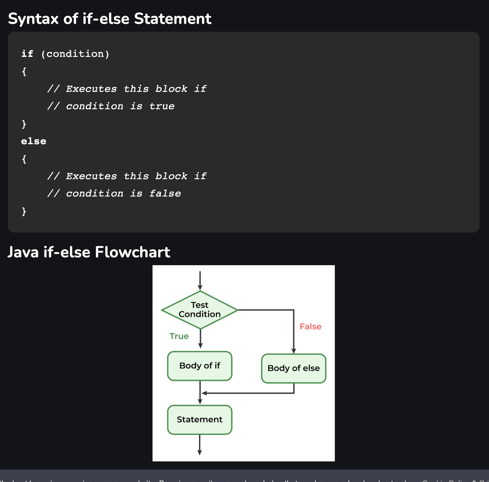

# 🌌 Solar System in Processing 🪐

Hello, budding astronomers and programmers! Let's embark on an interstellar journey to create a model of our solar system at a certain point in time. Don't worry, soon we'll make those celestial bodies revolve! 🚀 First, however, you should click on the gif below to decide which phase of our solar system you will simulate. 

Learn about the solar system, and pick the phase you will simulate.

Peer Review

    
Before moving on, you must have your idea/plan peer-reviewed by three other students, and you will be asked to explain the <a href="https://processing.org/reference/translate_.html"> `translate(x,y)` function</a>, use user input via the mouse, a conditional based on said input, and some pretty shapes 💖
    
    - When Being reviewed: Create a flow chart of your program logic. Then, explain how said logic will represent stage X of our solar system to your peers. Record your feedback from peers for credit.
    
    - When Reviewing: Provide a grow, glow, and original comment 

---

## 🛠 Setting Up

    
Install Processing

     
    1. Get the IDE
    - Visit <a href= "https://processing.org/download/"> Processing's download Page</a>
    - Install and launch Processing. It's like our spaceship control room!

   2. **Ensure You're in Java Mode**:
    - Processing uses Java by default. Just ensure you see 'Java' in the top right.
    

  
🌟 Hint: Troubles installing?

Make sure you have the right version for your operating system. If you get stuck, ask a classmate or your teacher for help.

---

## 🌞 Step 1: Set up the Cosmic Canvas

  
👾 Code Example

🌟 Hint

    
"The `size(800, 600);` sets our universe's width and height. Feel free to make it bigger or smaller!"

## 🌞 Step 2: Light Up the Stars

  
👾 Code Example

    

  
🌟 Hint

   
 The `ellipse(400, 300, 100, 100);` function draws the sun. The first two values set the position (x,y), and the last two values set the width and height of the ellipse.
     
     
        
         
         
You already have been making flow charts and using conditionals! here is a basic condition in java!
 
 
        

## Step 3 & 4:  If 🐁 do
Look up and add user input and a conditional to your program. I suggest using the mouse, but you can use whichever method you like. 

  
🌟 Input Hint

    Input is the first thing I think about. What data does the program need? Check out this link to see how processing allows a programmer to create interactive works of art!
     
     
        <a href=https://processing.org/examples/mousefunctions.html > Processing Mouse Example </a>

  
🌟 If/Else Hint

   If statements in Java are the same as in every language. The only change is in the structure of the words, i.e., syntax.
     
     
    
 

    
 

Here is the actual Java code!

## 🪐 Step 5: Add All Planets

Can you add the moons, asteroid belts, or scale planet sizes? Soon, we will make this
solar system spin :)

