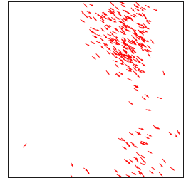

# Object-Oriented Solar System in Processing

Welcome to this guide on creating a basic solar system using Object-Oriented Programming (OOP) in Processing. This tutorial offers a gentle introduction to OOP concepts using a visual and engaging topic.

You will learn the logic of OOP, how to converse, design, and program in this paradigm, and control literally hundreds of your creations at once.

## 🦄 What is OOP 🦄
 

OOP is a paradigm in programming where we model our program structure around "objects" rather than procedures. These objects contain data (attributes) and can perform actions (methods).

 🌈 Step 1: What is a Class? 🌈

In OOP, a class is a blueprint for creating objects. For our solar system, we'll think of each planet as an object, and they will be created from the `Planet` class. This is the class provided to you. You will almost never code from a blank slate, save for research and school :)

While looking, write down 3 questions you have and try to find a method and an attribute. 

Here, the <em>Planet</em> class has attributes (like <em>radius</em> and <em>distance</em>) and methods (like <em>show</em> and <em>update</em>).

  
🛸🔴👽 Side Quest 🌕🔴🛸 

  Use NASA's OpenAPI resources to get a real image of Mars from one of their rovers. Report back on how you did this to the class.

<a href="https://api.nasa.gov/"> Application Program Interface (API) </a>

<a href="https://youtu.be/4czjS9h4Fpg?feature=shared"> Mars Landing </a>

Let's break this down step-by-step by adding new methods and attributes!

---
 

## 🛰️ How Can I Create Objects 🛰️

Every time we use the planet class to create a new plant we are creating an object of the planet class. This process has a fancy name called instantiation. When we instantiate an object, we call this an instance of the planet class. We are going to make hundreds of planets. So, we will have hundreds of instances of a single class. Woof!

 Step 2: 👽 Planet Class 👽 

With our class defined & commented on, we can create objects, which are instances of a class. 

Here, we've created two objects: `sun` and `earth` from the `Planet` class. This is what we mean by Instance of a class, an object, or to instantiate an object.

 

---

 
 

## 🚧  Where Can I edit Objects 🚧

Time to call our objects.

 Step 3: 🧙 Using Methods of the Object 🧙 

Each object can use the methods defined in the `Planet` class.

 
In this segment, we call the `show` and `update` methods for both the `sun` and `earth` objects.

---

 
 

## 🍀 Why Double-Check 🍀

    
🔮 Step 4: Am I Done Check List🔮 

    
1. 3 instances of planet class
2. 3 unique methods used
3. Art aspect clear
4. Science aspect clear
5. Add a new method to planet-class that will make the planet move
6. Add a new attribute to planet-class
7. User input used
8. Conditional Statement used
9. A TODO programming list for the next class: see steps 9-10
10. Calculate the force of gravity between one of your planets & sun by using their masses irl
11. Make step 10 a new method by first completing step 9 for this task :)

