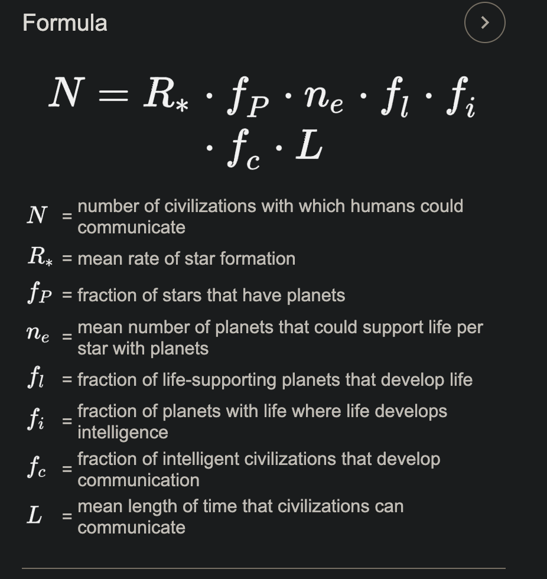
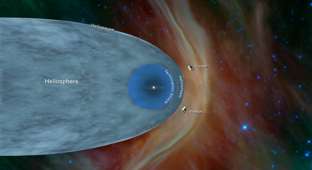
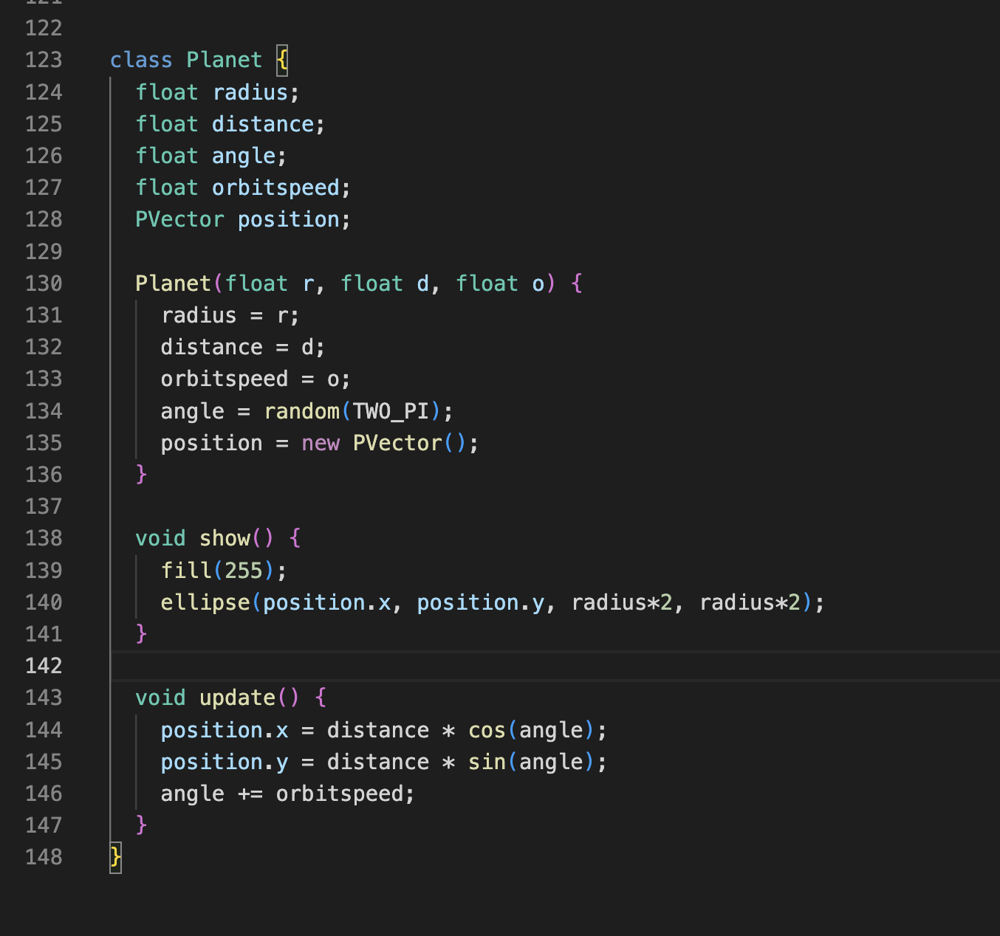
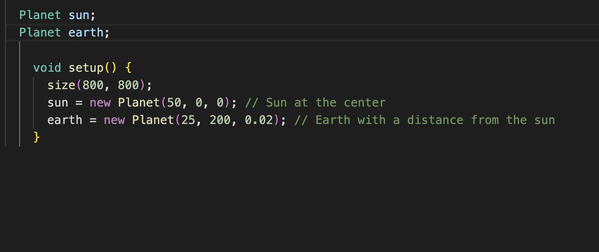
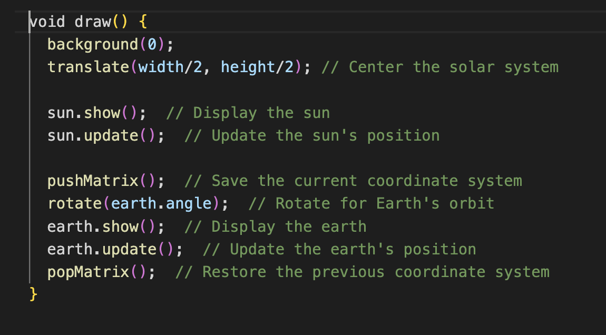
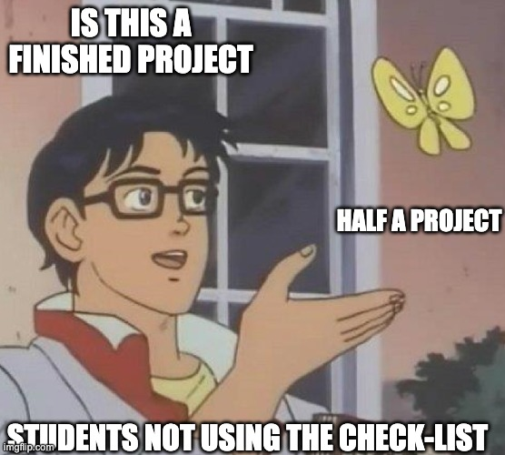

# 👾 Are We Alone? 👾

 

🌱 Objectives 🌱  

1.) Create a model for the Fermi Paradox to simulate varying scenarios
 
2.) Display the potential number of alien worlds with 🌱 life 🌱 in a sketch
 
3.) Answer the Fermi Paradox

    
    

 

The left is a photo from the <a href="https://webb.nasa.gov/"> James Webb Space Telescope</a>. Each radiant point you see isn't just a star – it's an entire <a href="https://physics.stackexchange.com/questions/160283/are-we-seeing-the-past-when-we-look-at-the-stars">galaxy</a>, each cradling billions of stars within its embrace. When you gaze upon these points of light, you're not merely observing space but traveling through ⏳ time ⏳, witnessing remnants from the very dawn of our universe. On the right, marvel at the animated brilliance of the James Webb Space Telescope itself, the groundbreaking telescope that is 72 feet by 39.4 feet! How'd they get that into space!?

## ⭐ Fermi Paradox ⭐

The Fermi Paradox addresses the question: why do we seem alone in the universe? Scientists believe there are billions of stars in our galaxy, many of which could harbor Earth-like planets. With the vast number of possibilities, it seems probable that other intelligent life would exist. Yet, the mystery remains: if there are numerous potential alien civilizations, why haven't we detected any signs of them? Why is the universe so silent?

The Fermi Paradox describes the contradiction between the high likelihood of extraterrestrial civilizations existing and our absence of evidence or contact with these civilizations. 

Code 1: Turn the Drake Equation Into A function

 

🚀How Far Have Humans Gone Beyound our Solar System🚀

 

## Lesson 1: 👩‍🍳 Functions & Arguments 🍎🥦

Functions and arguments go hand in hand! 🤝 Think of a function as a chef 👩‍🍳 and arguments as the ingredients. You provide the ingredients to the chef, and she whips up a delightful dish! 🍲

👩‍🍳 Functions Explained 👩‍🍳

A function operates like a mini-program within your main program. It allows you to bundle code, assign it a name, and utilize it multiple times. Visualize a magic box 🎁 that performs a task every time you invoke it.

 

**Imagine Functions as Magic Boxes 🎁**

You know those magic boxes in fairy tales where you put something in, whisper a magic word, and get something totally different or amazing out? That's exactly how functions in Java (and most programming languages) work!

### The Name of the Function 📛

Every magic box (function) has a name. This way, you can tell it apart from other magic boxes. So, if you have a magic box that turns apples into gold, you might call it `turnApplesToGold`.

### Function: Arguments = Ingredients 🍎

Sometimes, the magic box needs something from you to work. These are called "inputs" or "arguments". Imagine you have a magic box that makes juice. You have to give it fruits, right?

<pre><code>
void makeJuice(String fruit) {
    // Magic happens here!
}
</code></pre>

Here, `fruit` is what you give the magic box. So, if you want apple juice, you'd use the box (call the function) like this:

<pre><code>
makeJuice("apple");
</code></pre>

### Inside the Function 🎩✨

Inside the magic box, there are instructions about what to do with what you gave it. These instructions are the lines of code inside the function.

### Function Output ✨

Sometimes, the magic box gives you something back. Like, you put in an apple and get out juice. In Java, we decide what kind of thing we're going to get back using words like `int`, `String`, etc. If a magic box doesn't give anything back, we use the word `void`.

For instance, if our juice-making magic box gives back juice, it might look like:

<pre><code>
String makeJuice(String fruit) {
    // Magic happens here!
    return "juice"; // This is what you get back!
}
</code></pre>

### Using a Function 🪄

To use a magic box (or function), you simply say its name and give it what it needs (if it needs anything). This is called "calling the function."

Example:

<pre><code>
String myJuice = makeJuice("apple");
</code></pre>

And there you go! That's how functions in Java work. They're just like magic boxes where you put something in, some magic happens, and you might get something awesome out. 🪄✨

## Lesson 2: 🌍 What is Scope? 🌍

Scope

Scope acts as an invisible barrier ⛩️ around segments of your code. Variables (like `x = 5`) exist within these boundaries. In programming, the term "scope" refers to the part of the code where a variable or function is accessible. Think of it as the "reach" or "visibility" of a variable or function.

### Why is Scope Important? 🤔

Imagine you have a secret diary that you only read in your room. Within your room, you can read it anytime (this is its "scope"). However, when you're in the living room, you can't access it because it's out of its "scope" or reach. In a similar way, in programming, variables and functions have places where they can and cannot be accessed.

### Types of Scopes in Java 🧐

1. **Local Scope (or Block Scope):**  
   Variables defined inside a method, constructor, or block are said to be in the local scope. They are accessible only within the method or block where they are declared.

  <pre><code>
   public void showName() {
       String name = "Alice"; // This is a local variable
       System.out.println(name);
   }
   
   // Outside the method, 'name' is not accessible.
   
</code></pre>

2. **Global (or Class) Scope:**  
   When a variable is declared at the class level (but outside any method), it's accessible from any method in the class (unless it's private and you're trying to access it from outside the class). These are often referred to as class or member variables.

   <code><pre>
   public class MyClass {
       String globalVar = "I am global!"; // This variable has class scope

       public void showGlobalVar() {
           System.out.println(globalVar); // Accessible here
       }

       public void anotherMethod() {
           System.out.println(globalVar); // Also accessible here
       }
   }
   </code></pre>

3. **Package Scope (Default Scope in Java):**  
   If a class, method, or variable doesn't have a specific access modifier (like `public`, `private`, or `protected`), it's accessible only within its own package. This is the default scope in Java.

4. **Protected Scope:**  
   When a member is declared as `protected`, it can be accessed within its own package and by subclasses.

5. **Public Scope:**  
   When a member is declared as `public`, it can be accessed from any other class in any package, assuming the class it resides in is also accessible.

Remember, understanding scope is crucial because it helps you manage data and control what parts of your program can and cannot see or modify that data. Proper scoping ensures cleaner, more readable, and more maintainable code.

## Lesson 3: 🌟 Introduction to OOP 🌟

OOP

OOP revolves around the idea of designing programs based on "objects". These objects hold data (attributes) and are capable of performing actions (methods).

---

### 🌍 Step 1: Understanding Classes 🌍 

In the world of OOP, a class is the blueprint for objects. For our solar system, we'll treat each planet as an object, crafted from the `Planet` class. Remember, most of the time you're working with existing templates.

While exploring, jot down 3 questions you have, and spot a method and an attribute. This is my class, however, you will now design and then build your class after peer review! What data points does an object of your class need?

OOP Class 

  
Notice how the `Planet` class contains attributes (e.g., `radius`, `distance`) and methods (e.g., `show`, `update`). 

🛸 Mars Side Quest 🛸

Unlock the mysteries of Mars using NASA's API to fetch a real image captured by a rover.

- [NASA's API Portal](https://api.nasa.gov/)
- [Mars Landing Video](https://youtu.be/4czjS9h4Fpg?feature=shared)

Share your discoveries with the class!

---

### 🚀 Step 2: Understand The Class 🚀

With our class in place, let's bring to life some celestial objects by calling our Planet class.

  
Creating Class Objects 

  
  

Behold! We've just manifested two cosmic entities: `sun` and `earth`. These are instances (or objects) of our `Planet` class.

  🔭 Step 2.5: Interacting with the Cosmos 🔭

 

Unleash the power of our celestial objects. Watch as the `sun` and `earth` respond to our command, utilizing methods from the `Planet` class. Make sure you know how to replicate creating an unique planet.

  
 Adding Class Methods 

    

### Step 3: Create Your Planet Class 🪐

Our planet will have a few attributes: its position, radius, and rotation speed. What else would you like it to have?

  
 Create the Planet Class

<pre><code>
class Planet {
  float x, y;       // position of the planet
  float radius;     // size of the planet
  float angle = 0;  // initial angle for rotation
  float speed;      // rotation speed
  
  // Constructor: This is how we create an instance of the planet
  Planet(float x_, float y_, float r_, float s_) {
    x = x_;
    y = y_;
    radius = r_;
    speed = s_;
  }
</code></pre>

🌌 Step 3.5: Methods 🌌

To start off, we'll create a simple method, action, to show our Planet class and its attributes like radius.

<pre><code>
class Planet {
  float radius;

  Planet(float r) {
    radius = r;
  }

  void show() {
    ellipse(0, 0, radius*2, radius*2);
  }
}
</code></pre>

---

## 💃 Step 4: Time to Spin 💃

To make our planet spin, we'll add a new method to our Planet class. This method will rotate the planet each time it's called. With this method, you can now display your planet with rotation! Call this method in your draw() function and provide an angle (which you can increment each frame to see continuous rotation).

 Spin Method 

<pre><code>
void rotateAndShow(float angle) {
   // code along
}
</code></pre>

For example, in your draw()

<pre><code>
angle += 0.05;
planet.rotateAndShow(angle);
</code></pre>
Make sure you define the angle variable at the top of your sketch!

### 🎨 Step 5: Final Checks & Challenges 🎨 

Before you launch, ensure you've:

  
Grade Yourself

  

1. Create 3 instances of the planet class.
2. Create 3 unique methods.
3. Showcase the artistry of your solar system.
4. Embedd the science behind your design.
5. Method in the `Planet` class to make planets move.
6. Introduce 3 new attribute to the `Planet` class.
7. 1 conditional statement.
8. Create a TODO list for the next session to start solving these two questions:
    9. Compute the gravitational force between a planet and the sun using their real-life masses.  
    10. Transform step 10 into a new method, but only after tackling step 9.

---

Embrace the universe of programming, and let the cosmos be your guide! 🌌
