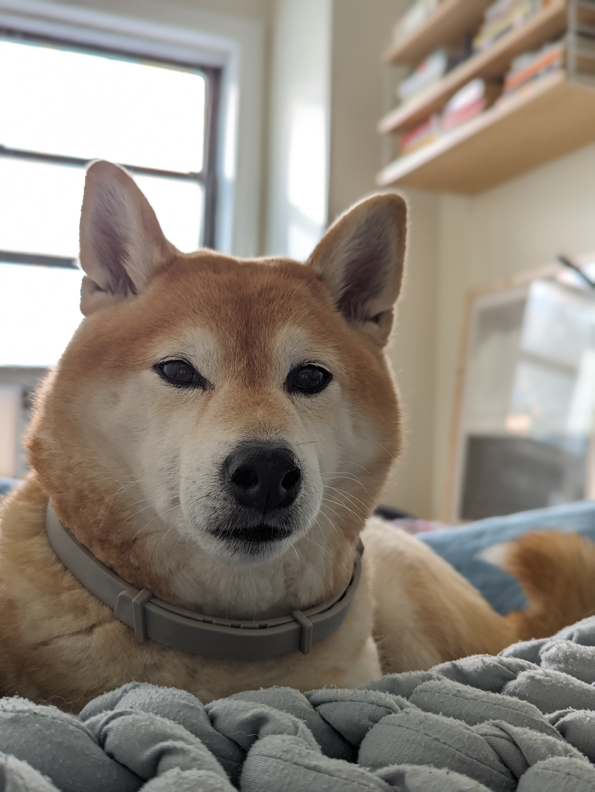

## 💖 For Loops 💖

Quick Syntax Lookup

<pre><code>

// actual code
for(int i = 0; i < 10; i = i ++){
        // do something
}

// start: int i = 0
// condition: i = 10
// step: i = i + 1
</code></pre>

 

Today, you will automate creating shapes, colors, and positions to easily create 100's of <a href="https://en.wikipedia.org/wiki/Object_(computer_science)">objects</a> in a few lines of code.

Moving on, we will then learn how to control this crew of <a href="https://en.wikipedia.org/wiki/Object_(computer_science)">objects</a> you have made!

## 📖 Story Time 📖

Imagine you have a toy robot that you can program to perform a set of actions. Let's say you want this robot to move forward a step. You'd give it a command, like "Move forward!" and it would take one step.
But what if you want the robot to move forward 5 times?

You have a few options:

Tell the robot "Move forward!" five separate times.
Or, you can be more efficient and say something like "Repeat 'Move forward!' 5 times."

This idea of doing something repeatedly, without having to write out the same command over and over, is essentially what a "for loop" does in programming!

## 🧬 Three Main Parts 🧬

In programming, a for loop has three main parts:
 

1. Starting Point: This is like telling the robot when to start. For example, "Start counting from 1."
 

2. Ending Point: This is like telling the robot when to stop. For example, "Stop when you've moved 5 times."
 

3. How to Move: This tells the robot how to progress between the start and the end. For example, "Move one step at a time."
 
 
So, if we wanted to translate our robot's repeated movement into a for loop, it'd look something like:

<pre><code>
for(int step = 1; step <= 5; step++) {
    robot.move();
}
</code></pre>

## 🔬 Here's what's Happening 🔬

1. int step = 1: We start counting with the number 1 (our robot's starting point).
 
 
2. step <= 5: We keep going as long as the step number is 5 or less (our robot's ending point).
 
 
3. step++: Each time we go through the loop, we add one to the step (this is our robot moving one step at a time).
 
 
4.{} Inside the loop (between the curly braces { }), we'd put the command to move the robot forward. The loop would then repeat that command 5 times!

## 💖 Why Are Loops Useful? 💖

Loops are important for automation, modeling, and simulations. They help us control time, conduct expirments, and to easily create complex objects :)

🐶🐶🐶
 
Estelle is proud of you!
        

Think about if we wanted the robot to move 100 times, or 1,000 times. Without loops, we'd be giving our robot the same command over and over, which is tiring and not efficient. But with a loop, we can give the command once and just tell the computer how many times to repeat it.

