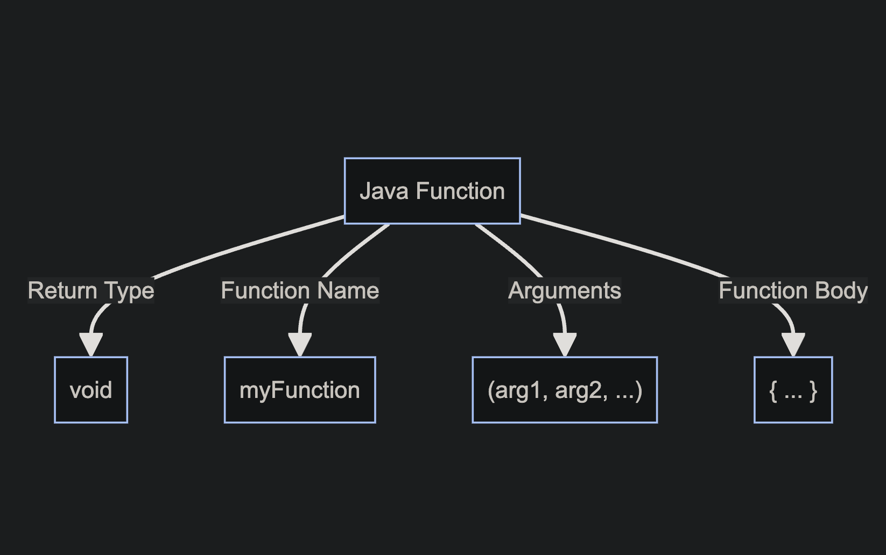

# 🎨🖥 Processing & Functions 🎨🖥

Processing provides you with a platform to express your creativity in a digital canvas. At the heart of it all, you have functions that play distinct roles. Let's take a closer look.

All of these come together to look like so  

<pre><code>
void dogBark(){

function code goes here

}
</code></pre>

A function operates like a mini-program within your main program. It allows you to bundle code, assign it a name, and utilize it multiple times. Visualize a magic box 🎁 that performs a task every time you invoke it.

<h2> Objective </h2>

- To create and use your own custom methods
  
 

When you're just starting, remember that it's okay if things don't make perfect sense right away. With time and practice, it'll become second nature! And the most important thing is to have fun experimenting and creating with Processing.

<h2> Functions</h2>  

Imagine Functions as Magic Boxes 🎁
You know those magic boxes in fairy tales where you put something in, whisper a magic word, and get something totally different or amazing out? That's exactly how functions in Java (and most programming languages) work!
 
 
<h3>The Name of the Function 📛</h3>

Every magic box (function) has a name. This way, you can tell it apart from other magic boxes. So, if you have a magic box that turns apples into gold, you might call it `turnApplesToGold`.
 

<h3>Using a Function 🪄</h3>

To use a magic box (or function), you simply say its name and give it what it needs (if it needs anything). This is called "calling the function."
 
Example:
 

<pre><code>
makeJuice();
</code></pre>

thats all there is to calling a function! Processing is super cool, and provides us with predefined functions. You've actually been using/calling these functions since day 1 of processing!!!

 
<h2> Void Setup </h2>
void setup() is a special function that sets the initial state of our canvas.

 👾 Explained 👾

 
Think of it as the first step where you lay out all your tools and prepare your drawing space.
 

<h3>Preparing Your Sketchbook</h3>

<pre><code> void setup() </code></pre>
 
In Processing, the function 
  
<pre><code> void setup() </code></pre>
This is like preparing your sketchbook. It runs once, right at the beginning when you first start your program. Inside void setup(), you can:
 
 

- Set the size of your canvas using the function
  <pre><code>size()</code></pre> 
- Choose the background color with the function
  <pre><code>background()</code></pre> 
- Initialize variables.
- Load images, fonts, or sounds you want to use later.
- Basically, any initial preparations you need before your main drawing begins.

 

Example
<pre>
  <code>
  void setup() {
      size(400, 400);          // Set canvas size to 400 pixels by 400 pixels
      background(255, 0, 0);   // Set background color to red
    }
  </code></pre>

 
<h2> Void Draw </h2>
Continuously Drawing on Your Canvas. The void draw() function is like the act of drawing on that prepared sketchbook page.

  
👾 Explained 👾

  <pre><code> void draw()</code></pre>
   
   But there's a twist! Whatever you put inside void     draw() happens over and over again, almost like you're drawing, erasing, and redrawing repeatedly super fast (typically 60 times per second). This makes it perfect for animations, games, or any interactive programs where things change over time.
     
     
    Inside void draw(), you can:
    - Draw shapes (like circles, rectangles, lines, etc.).
    - Check for user inputs (like mouse clicks or key presses).
    - Update positions of objects for animations.
    - Change colors, sizes, or any other properties of your drawings.
   
   

  Example
   
  <pre>
    <code>
    void draw() {
      background(220);         // Set a gray background every frame
      ellipse(mouseX, mouseY, 50, 50);  // Draw a circle at the mouse position
    }
    </code>
  </pre>
    Give the code example a try!
   
  Here, the ellipse() function draws a circle. The 
  <pre> <code> mouseX and mouseY</code></pre> 
  are special variables that always store the current position of the mouse. Since draw() is running over and over, the circle will appear to follow your mouse as you move it around the canvas!
   

# Lab
Before moving on, ensure you have created a custom function called **randColor()** that creates a random color for a shape. Create three other custom functions for your sketch that utilize user input. Make sure to include & customize the functions listed below.

 
- void setup() 
 
- void draw() 
 
- create **randColor()** method
 
-  <a href='https://processing.org/reference/mousePressed_.html'>mousePressed()</a>
 
-  <a href ="https://processing.org/reference/mouseReleased_.html">mouseReleased()</a>
 
- <a href="https://processing.org/reference/keyPressed_.html">keyPressed()</a>
 
 

 
Part Two

 
# Arguments = Ingredients 🍎

Sometimes, the magic box needs something from you to work. These are called "inputs" or "arguments". Imagine you have a magic box that makes juice. You have to give it fruits, right?
 
<pre><code>
    void makeJuice(String fruit) {
        // Magic happens here!
    }
</code></pre>
 
 

Here, `fruit` is what you give the magic box. So, if you want apple juice, you'd use the box (call the function) like this:
 
 

<pre><code>
makeJuice("apple");
</code></pre>

 

<h3> Inside the Function 🎩✨</h3>

Inside the magic box, there are instructions about what to do with what you gave it. These instructions are the lines of code inside the function.
 

<h3>Function Output ✨</h3>

Sometimes, the magic box gives you something back. Like, you put in an apple and get out juice. In Java, we decide what kind of thing we're going to get back using words like `int`, `String`, etc. If a magic box doesn't give anything back, we use the word `void`.
 

For instance, if our juice-making magic box gives back juice, it might look like:
 

<pre><code>
String makeJuice(String fruit) {
    // Magic happens here!
    return "juice"; // This is what you get back!
}
</code></pre>
 

<h3>Using a Function 🪄</h3>

To use a magic box (or function), you simply say its name and give it what it needs (if it needs anything). This is called "calling the function."
 

Example:
 

<pre><code>
String myJuice = makeJuice("apple");
</code></pre>

And there you go! That's how functions in Java work. They're just like magic boxes where you put something in, some magic happens, and you might get something awesome out. 🪄✨

# 🌍 What is Scope? 🌍

Scope acts as an invisible barrier ⛩️ around segments of your code. Variables (like `x = 5`) exist within these boundaries. In programming, the term "scope" refers to the part of the code where a variable or function is accessible. Think of it as the "reach" or "visibility" of a variable or function.

Scope

    
<h3>Types of Scopes in Java 🧐</h3>

 

Imagine you have a secret diary that you only read in your room. Within your room, you can read it anytime (this is its "scope"). However, when you're in the living room, you can't access it because it's out of its "scope" or reach. In a similar way, in programming, variables and functions have places where they can and cannot be accessed.

 
 

<h3> Local Scope (or Block Scope) </h3>

Variables defined inside a method, constructor, or block are said to be in the local scope. They are accessible only within the method or block where they are declared.

 

<pre><code>
   public void showName() {
       String name = "Alice"; // This is a local variable
        // Outside the method {}, 'name' is not accessible.
       System.out.println(name); 
   }
</code></pre>

<h3> Global (or Class) Scope </h3>

When a variable is declared at the class level (but outside any method), it's accessible from any method in the class (unless it's private and you're trying to access it from outside the class). These are often referred to as class or member variables.
 

<pre><code>
   public class MyClass {
       String globalVar = "I am global!"; // This variable has class scope
            public void showGlobalVar() {
               System.out.println(globalVar); // Accessible here
           }
       public void anotherMethod() {
           System.out.println(globalVar); // Also accessible here
       }
   }
   </code></pre>
 

<h3>Package Scope (Default Scope in Java)</h3>

If a class, method, or variable doesn't have a specific access modifier (like `public`, `private`, or `protected`), it's accessible only within its own package. This is the default scope in Java.
 

<h3>Protected Scope</h3>

When a member is declared as `protected`, it can be accessed within its own package and by subclasses.
 

<h3>Public Scope</h3>

When a member is declared as `public`, it can be accessed from any other class in any package, assuming the class it resides in is also accessible. 
 

Remember, understanding scope is crucial because it helps you manage data and control what parts of your program can and cannot see or modify that data. Proper scoping ensures cleaner, more readable, and more maintainable code.

