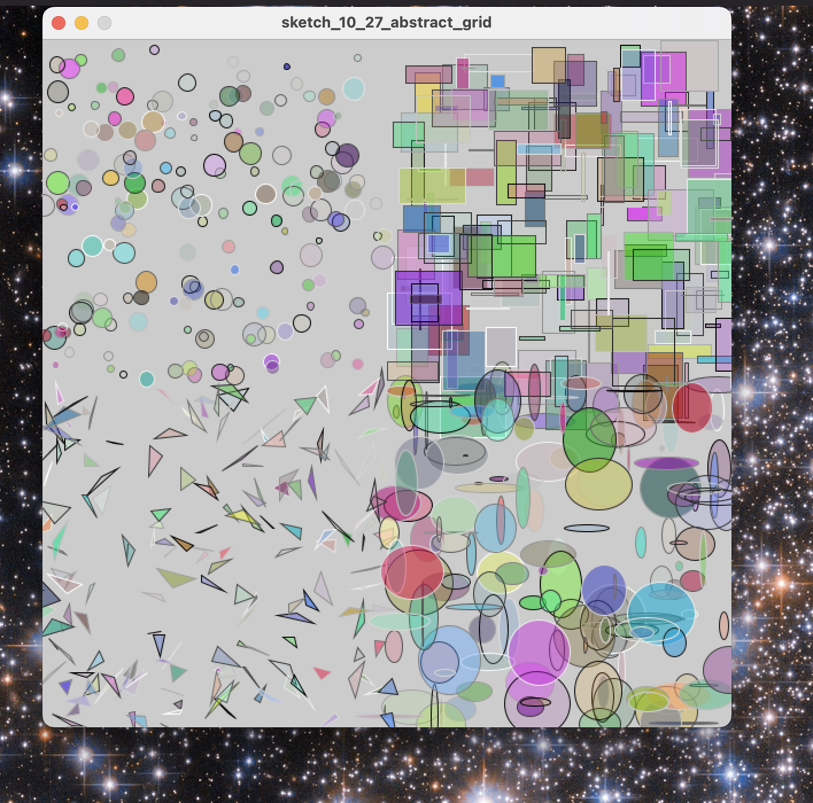

# Abstract & Random Art 🎨

## Objective

Let's create a piece of art where the computer surprises us with colorful shapes every time we run our program. By the end, you'll have a mini artwork generator on your computer! 🖼️

 
 

## ✨ Check List for Assignment ✨

1. Top-left quadrant: Randomly sized and colored Circles
 
2. Top-right quadrant: Randomly sized and colored Rectangle
 
3. Bottom-left quadrant: Randomly sized and colored Triangle
 
4. Bottom-right quadrant: Randomly sized and colored Ellipse
 

## 📏 The Grid 📏

Imagine a large piece of graph paper where you can draw and color shapes. This paper has horizontal lines (we call them rows) and vertical lines (we call them columns). Each intersection of a line is a point we can identify with an x (horizontal) and y (vertical) value. Think of it as the game board for Battleship, but for art! 🎲
 
In the world of Processing (and many other graphics systems), this "graph paper" starts with the point (0,0) in the top-left corner. As you move to the right, the x value increases. As you move down, the y value increases. 

🔍 **Did you know?** This is different from the math graphs you learn in school where (0,0) is in the center!

## 🧑‍🤝‍🧑 Together 🧑‍🤝‍🧑

Now, let's sprinkle some magic and create randomly colored and sized rectangles in the top-right quadrant of our sketch! 🪄

👩‍💻 Code Answer 👩‍💻 

<pre><code>
void setup() {
  size(600, 600);
}

void draw() {
// Top-left quadrant: Circle

// Set a random fill color for the circle. The color is determined by random values for the red, 
// green, and blue channels (each ranging from 0 to 255). An additional random value (ranging 
// from 0 to 155) is used to determine the alpha transparency of the fill color.
fill(random(255), random(255), random(255), random(155));

// Set a random stroke color for the circle. This is determined by a single random value 
// which affects the brightness of the color (ranging from 0 to 255).
stroke(random(255));

// Draw a circle on the canvas:
// The x-coordinate is randomly placed within half the width of the canvas (0 to width/2).
// The y-coordinate is randomly placed within half the height of the canvas (0 to height/2).
// The diameter of the circle is a random value between 5 and 20 pixels.
circle(random(width/2), random(height/2), random(5, 20));

}
</code></pre>

Now, do the same for cirles, ellipses, and triangles for the other 3 corners of the grid! 
