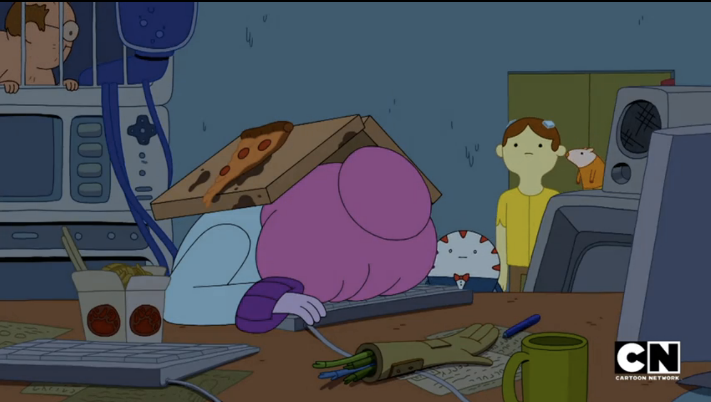

# MileStone One

Think of a milestone on the road: it marks how far you've come and signals towards the journey ahead. Similarly, your Milestone Project is a significant marker in your coding adventure. It's a comprehensive assignment designed to showcase all the skills you've acquired so far, especially your newfound ability to create and use functions.

## Sharing Work
If you create a game you'd like to share, Ms. James would love to showcase said projects on this website for future visual coding classes! Simply email and let me know :)

## Step 1: Understanding the Project Requirements

Create an original game that uses mouseX and mouseY, or the Keyboard, to allow the user interaction with said sketch. Here are a few examples you may choose from. Please feel free to create your own game! The game must be structured with functions. Code hygine will be a large factor in reviews.

The game should take about a week to plan, code, and debug. The complexity should be on par with the examples below. If making your own game, make sure to checkin with your instructor.

# Interactive Game Ideas 🎮

## 1. Color Match Challenge 🌈
**Description:** Players control a paddle at the bottom of the screen using the mouse. Different colored balls fall from the top, and the player must change the paddle's color (by clicking different keyboard keys) to match the color of the falling ball. Points are gained when the ball and paddle colors match upon collision. The game's pace increases over time.

## 2. Star Collector 🌟
**Description:** Players navigate a small spaceship (using the mouse) across the screen to collect stars that appear in random positions and sizes. The spaceship changes color based on its position on the screen, and only stars matching the spaceship's color can be collected. The game speeds up and adds more stars as the player's score goes up.

## 3. Dynamic Maze 🔮
**Description:** Players navigate a constantly shifting maze using their mouse. The walls of the maze change and move, requiring players to continuously find new paths. The cursor (a small square or circle) changes size based on movement speed. The goal is to reach the end of the maze as quickly as possible.

## 4. Artistic Pong 🎨
**Description:** A creative variation of Pong where the player uses the mouse to control a paddle on one side of the screen. Each hit of the ball changes its color and leaves a colored trail. The paddle's size decreases as the player scores more points. The objective is to keep the ball in play while creating a visually appealing color pattern.

## 5. Reflection Puzzle 💡
**Description:** This puzzle game involves controlling a light source with the mouse to illuminate a target. Players adjust mirrors in the level to reflect the light at the correct angle. The light's color changes based on its screen position, and only light of a specific color can activate the target.

## Turn In

When you're ready to submit the project, you should prepare a compressed folder containing:
   
- Planning document: This includes the project plan, with details on the functions and structure of your program.
     
- Code: The commented Java code files for your project.
     
- Video walkthrough: A video recording where you demonstrate and explain how your program works.
This checklist is designed to guide you through the project from conception to submission, ensuring that you cover all necessary steps to create a well-thought-out, functional, and polished piece of software.
     
